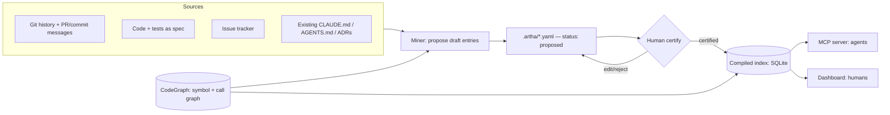
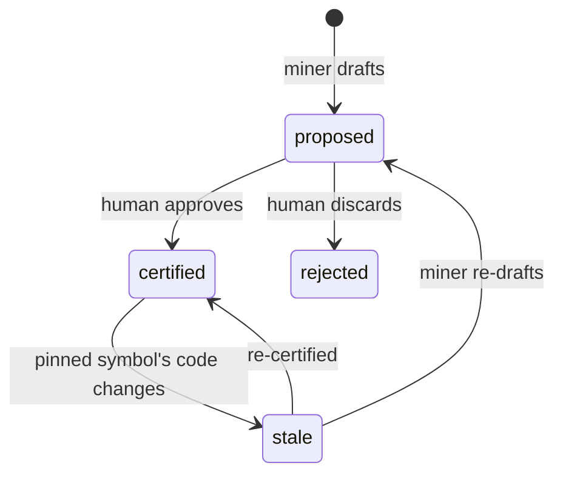
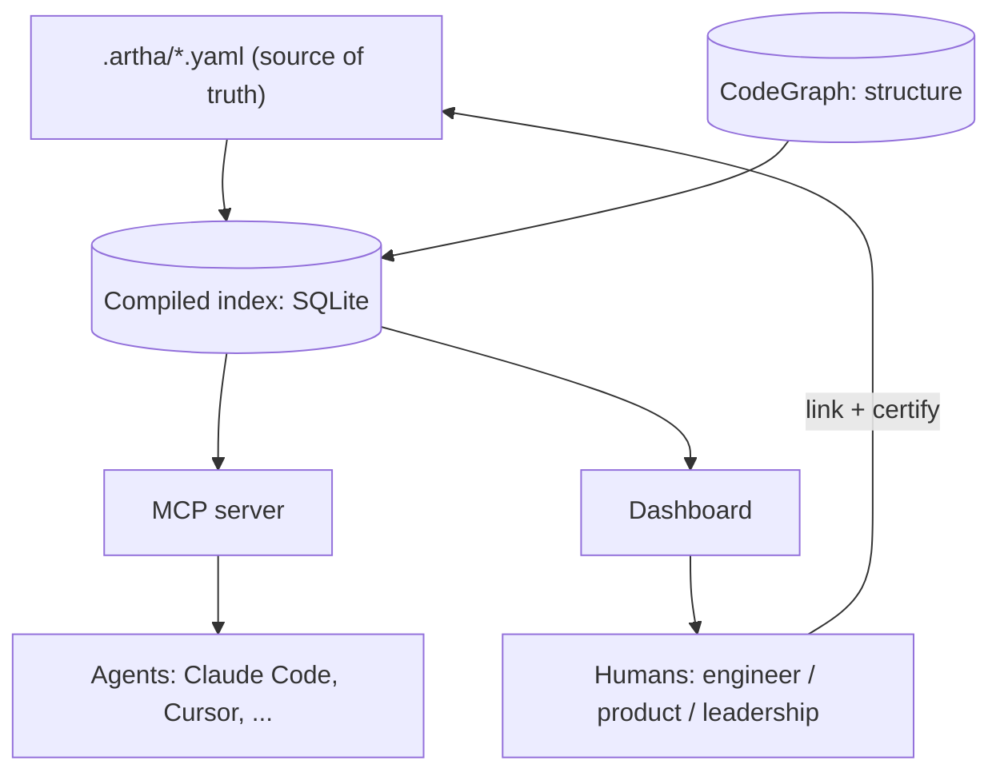

# Artha — a product-understanding layer for AI coding agents

> **Working codename:** *Artha* (Sanskrit: *meaning / purpose / intent*) — placeholder, swap freely.
> **Type:** Open-source project (community-first)
> **One line:** A git-native semantic layer that gives AI coding agents *and humans* the *product intent* behind code — domain models, state machines, invariants, conventions, and the *why* behind decisions — built on top of an existing structural code graph (e.g. CodeGraph), served just-in-time over MCP to agents and as an elegant product↔code map to people.
> **Status:** Pre-v0.1 design. This document defines the problem, the prior art, the design, and the MVP.

---

## 1. The problem

AI coding agents fail on real codebases in a specific, repeatable way. With full access to the code and the database, they still:

- **Don't understand the product.** They see that an `Order` class exists; they don't know an order moving to `confirmed` must reserve inventory, or that `shipped` fires a notification. That meaning isn't in the type signatures.
- **Miss the patterns.** They don't know the team always validates at the entry point, caches reads write-through, retries external calls with backoff, or never stores money as a float. So they generate plausible code that violates conventions the team takes for granted.
- **Re-derive context every time, expensively.** Asked "where is refund logic validated," a naive agent reads and re-reads dozens of files, burning a large fraction of its context window on *discovery* rather than *reasoning*.

And the humans have the mirror-image problem: product managers and leadership can't *see* how a capability is actually implemented, engineers can't see the rules that govern an area before they touch it, and the knowledge that ties code to product lives in a few senior heads.

These are actually **two different problems** wearing one word ("context"):

| | **Structural context** | **Semantic / product context** |
|---|---|---|
| Question it answers | What calls what? What breaks if I change this? Where is X defined? | What does this *mean* in the product? Why does it exist? What rules govern it? |
| Source | Extractable from code | Mostly *not* in the code — lives in people's heads, PRs, tickets, history |
| State of tooling (2026) | **Largely solved** | **Open frontier** |

The structural problem has a clear winning pattern: parse the repo, build a symbol/call/dependency graph into a local file, expose it to the agent over MCP so it queries structure instead of reading files. CodeGraph, GitNexus, Constellation, codemap, and Serena all do versions of this, with reported token reductions around 40–70% and large drops in tool calls.

The semantic problem is unsolved because **the information often does not exist in the code at all.** A graph can't extract intent that was never written down. This document is about building that missing layer — and making it serve both the agents and the people.

---

## 2. Thesis

> The structural graph is the *skeleton*. Artha is the *meaning* layered on top of it — served to agents *and* to humans from one source of truth — and the hard part isn't retrieval, it's keeping that meaning current cheaply.

Specifically, Artha captures the semantic context that today is scattered across three inadequate places:

1. **Nowhere** — it's in a senior engineer's head and lost when they leave.
2. **Flat instruction files** (`CLAUDE.md` / `AGENTS.md` / `MEMORY.md`) — which hold exactly the right *content* (domain vocab, conventions, decisions-with-rationale) but as a single hand-maintained file with a hard practical ceiling (~150–200 instructions an LLM reliably follows), no selective retrieval, no link to structure, and documented "silent rule dropout" and staleness.
3. **Auto-generated wikis** (DeepWiki, deepwiki-open) — which treat code as ground truth and so, by construction, cannot recover intent that isn't in the code.

Artha's job is to make this layer **structured, queryable, graph-linked, just-in-time, visible to people, and cheap to keep current.**

---

## 3. Prior art / existing solutions (and why a gap remains)

Honest landscape. Nothing below squarely owns the target.

**A. Structural code-graph engines** — CodeGraph (MIT, SQLite + tree-sitter + MCP), GitNexus, Constellation, codemap, Serena, Repomix.
*What they do:* model symbols, calls, dependencies, blast radius; serve over MCP.
*Why the gap remains:* they answer *structural* questions. They don't know *why* code exists or what business rules govern it. **Artha builds on these, not against them** — they provide the symbol IDs Artha pins meaning to.

**B. Auto-generated documentation / wikis** — DeepWiki (Cognition/Devin) + the self-hostable `deepwiki-open` (AsyncFuncAI).
*What they do:* generate a navigable wiki and Q&A from a repo; MCP server available.
*Why the gap remains:* they generate *from code as ground truth*. Excellent for "what does this code do," structurally. Cannot capture invariants, decisions, or domain intent that was never written into the code. Useful as **one mining input** for Artha, not a substitute.

**C. Convention / decision files** — `CLAUDE.md`, `AGENTS.md`, `MEMORY.md`, `.cursorrules`.
*What they do:* the de-facto standard for capturing decisions-with-rationale, domain vocabulary, and conventions — proof the *need* is real and mainstream.
*Why the gap remains:* flat, hand-maintained, all-loaded-into-context (competes for a tight instruction budget), no selective retrieval, no structural linkage, goes stale silently. **Artha consumes these as a mining source and can emit a compact generated slice back** for tools that only read flat files.

**D. Code-review tools with a context layer** — Greptile (closest funded competitor; $25M Series A, Benchmark). Builds a code graph, *learns team conventions from PR comments*, connects Jira/Notion/Google Docs for product context, and serves it over MCP.
*Why the gap remains:* Greptile is anchored in **code review**. Its semantic layer exists to judge PRs, and its learned rules are review-shaped (style, bug patterns). It is becoming "a rules engine other tools plug into," but it is closed, review-centric, and not a general-purpose, open, task-serving product-knowledge layer with a human-facing map. **This is the seam Artha threads.**

**The gap, precisely:** a *general-purpose* (not review-bound), *open-source*, *structured + queryable + graph-linked* product-semantic layer that captures *intent not present in code*, is served *just-in-time* over MCP to agents *and rendered as an elegant product↔code map for people* — with an explicit answer to the curation-cost problem everyone else tiptoes around.

---

## 4. What Artha is

Artha is four things working together:

1. **A semantic model** — a small ontology for the meaning of a codebase: domain concepts, entity state machines, invariants, conventions/patterns, decisions/rationale, and cross-cutting flows. (Section 6.)
2. **A hybrid curation pipeline** — auto-miners draft entries from git history, PRs, code, tests, and tickets; humans certify them with one click; entries auto-flag as *stale* when the code they pin to changes. (Section 8.)
3. **An agent-facing retrieval layer + MCP server** — task-shaped queries that return a small, ranked, token-budgeted slice of certified meaning, each item linked to the exact symbols in the structural graph. (Section 9.)
4. **A human-facing layer** — a local dashboard where engineers, product, and leadership *see* how the product maps to code, explore by role, catch contradictions, and — critically — *curate by linking and certifying*. Visualizing and linking are the same act, which is what makes the layer cheap to maintain. (Section 10.)

Components 3 and 4 are two surfaces over **one index**: the same certified meaning feeds the agents (MCP) and the people (dashboard), so they share a single source of truth.

Source of truth is **human-readable YAML committed to the repo** (in `.artha/`), so meaning is diffable, PR-reviewable, and travels with the code. A build step compiles it into a queryable index (SQLite, reusing CodeGraph's store) that both surfaces serve.

---

## 5. Design principles

1. **Stand on the structural graph; don't rebuild it.** Artha references CodeGraph symbol IDs. If CodeGraph isn't present, Artha can run a thin tree-sitter pass, but the graph is a dependency, not a feature to reinvent.
2. **Intent, not description.** Artha only stores what *isn't* recoverable from code. If a fact is in the types or obvious from the AST, it doesn't belong here. (Anti-bloat is a feature.)
3. **Just-in-time, token-frugal.** The win condition is *correct context in minimum tokens*. Default to returning a few hundred tokens of the *right* meaning, not a dump. Retrieval is task-shaped, ranked, and budgeted.
4. **Hybrid curation as the spine.** Auto-mined drafts lower the cost of writing; human certification guarantees fidelity. Neither alone works — pure auto hallucinates intent; pure manual never gets maintained. (Section 8.)
5. **Visualization is curation.** The human-facing view is also the authoring surface — people give meaning to code by exploring and annotating a map they want to look at, not by filling out forms. This is the structural answer to the maintenance problem. (Section 10.)
6. **Git-native and local-first.** Source of truth is YAML in the repo; the index, server, and dashboard run locally; no code egress required. Privacy and reviewability by default.
7. **Tool-agnostic via MCP.** Works with Claude Code, Cursor, Codex, Gemini CLI, OpenCode, etc. No new agent, no lock-in.
8. **Interoperate, don't compete, with the file standards.** Consume existing `CLAUDE.md` / `AGENTS.md`; optionally emit a compact generated `AGENTS.md` slice for flat-file-only tools.
9. **Trust must be visible.** Every item — whether returned to an agent or shown on the dashboard — carries `status` (certified/proposed/stale) and provenance (which PR/commit it was mined from), so the agent and the human know how much to trust it.

---

## 6. The semantic model (the ontology)

Five entry kinds. Each is a small YAML file in `.artha/`, pinned to one or more structural symbols. Examples below are JavaScript/TypeScript and deliberately vivid.

### 6.1 Domain concept
What a thing *means* in the product, including its state machine.

```yaml
# .artha/concepts/subscription.yaml
id: concept.subscription
kind: domain_concept
name: Subscription
status: certified                 # proposed | certified | stale
certified_by: brijesh
pins:                             # links into the structural (CodeGraph) layer
  - symbol: src/billing/Subscription.ts#Subscription
    content_hash: 9f2a1c          # invalidated when that symbol's code changes
summary: >
  A customer's ongoing paid access to a plan. Source of truth for entitlement:
  access checks read Subscription.status, never the Stripe object directly.
states:                           # intent that is NOT in the TS types
  - name: trialing   { effect: "no charge; entitlement granted" }
  - name: active     { invariant: "currentPeriodEnd is non-null and in the future" }
  - name: past_due   { effect: "entitlement retained for a 7-day grace window" }
  - name: canceled   { effect: "entitlement revoked at period end, not immediately" }
transitions:
  - { from: trialing, to: active,   trigger: "first successful invoice" }
  - { from: active,   to: past_due, trigger: "invoice payment failed" }
related: [concept.invoice, concept.entitlement]
```

### 6.2 Invariant
A rule that must always hold — the kind of thing a DB schema can't express.

```yaml
# .artha/invariants/money-minor-units.yaml
id: invariant.money_minor_units
kind: invariant
name: Money is integer minor units
status: certified
scope: [ "src/billing/**", "src/payments/**" ]
rule: >
  All monetary amounts are integers in the currency's minor unit (paise/cents).
  Never floats. Across API boundaries money is { amount: int, currency: string }.
why: decision.no_float_money       # cross-link to the rationale
detect: "number named *price|*amount used in decimal arithmetic"   # lintable signal
```

### 6.3 Decision / rationale (the *why*)
ADR-style, but mined and pinned. This is the highest-value, least-recoverable content.

```yaml
# .artha/decisions/0007-no-float-money.yaml
id: decision.no_float_money
kind: decision
title: Represent money as integer minor units, not floats
status: certified
date: 2025-11-03
context: "Invoices showed rounding drift of a few paise after tax + proration."
decision: "Store and compute money as integer minor units; format only at the edge."
consequences: "All billing math uses integer ops; a Money helper enforces it."
mined_from: { pr: "#412", commit: "a1b2c3d" }    # provenance attached by the miner
```

### 6.4 Convention / pattern
The unwritten "how we do things here."

```yaml
# .artha/conventions/soft-delete.yaml
id: convention.soft_delete
kind: convention
name: Soft delete via deletedAt
status: certified
scope: [ "src/**/repositories/**" ]
rule: >
  Records are never hard-deleted. Set deletedAt; default queries filter deletedAt IS NULL.
  A hard delete must be explicitly justified in the PR.
example_good: src/users/UserRepository.ts#softDelete
```

### 6.5 Flow (cross-cutting)
A multi-step behavior that spans services (e.g. "checkout," "refund," "onboarding"). Holds the sequence, the entry/exit points (pinned symbols), and the rules that apply across the path. Kept lightweight; links to the concepts/invariants above rather than restating them.

---

## 7. Storage & interop format

- **Source of truth:** YAML in `.artha/{concepts,invariants,decisions,conventions,flows}/`. Diffable, PR-reviewable, travels with the code, no special tooling to read.
- **Compiled index:** a build step (`artha build`) compiles YAML → SQLite (reusing/extending CodeGraph's DB), resolving `pins` to live symbol IDs and computing `content_hash` for staleness.
- **Pinning:** every entry pins to ≥1 structural symbol. The pin is the join between *meaning* (Artha) and *structure* (CodeGraph) and the trigger for staleness detection. It is also what lets the dashboard draw a concept↔code link.
- **Interop in:** ingest existing `CLAUDE.md` / `AGENTS.md` / `.cursorrules` / ADRs as mining inputs.
- **Interop out:** `artha export --agents-md` emits a compact, *generated* `AGENTS.md` containing only the highest-priority certified rules, for tools that read flat files only. (Adoption hook: useful even before a team installs the MCP server or the dashboard.)

---

## 8. Curation pipeline — the architectural spine

The chosen model is **hybrid: auto-mined draft + human certifies.** This is the heart of the project, because the reason this layer isn't already a solved product is that it requires upkeep, and teams won't do upkeep that's expensive. Artha's bet is to drive the marginal cost of a good entry toward *one click* — and, per Section 10, to make that click happen inside a tool people *want* to use.



**Mining inputs and what each yields:**
- **Git history + PR/commit messages** → *decisions/rationale* (the "why," with provenance). Highest value.
- **Code + tests** → *candidate invariants and conventions* (tests are an executable spec of intended behavior; recurring guard clauses imply conventions).
- **Issue tracker** → links a concept/flow to the requirement that motivated it.
- **Existing instruction files / ADRs** → pre-seed the layer; nothing already written is wasted.

**Lifecycle and staleness** — every entry has a status; staleness is automatic, not manual:



**Certification UX (the cost-killer):** mined drafts surface as a review queue in two places — as a PR (so certification *is* code review) and/or in the dashboard's review view (Section 10), where the human sees the drafted entry beside the code/PR it came from and approves, edits, or rejects in one action. A headless one-key CLI flow (`artha review`) exists for terminal users and is the v0.1 seed of the human-facing layer. Certification coverage and stale-entry count are first-class health metrics (Section 15).

**Drift handling:** when a pinned symbol changes, its entry flips to `stale` and is excluded from retrieval *as certified* (optionally returned/shown with a clear stale flag). The miner re-drafts; the human re-certifies. Drift is surfaced, never silent.

---

## 9. Retrieval & MCP interface (agent-facing)

This is the surface agents use; Section 10 is the surface people use. Both read the same compiled index.

Retrieval is **task-shaped and token-budgeted**. The flagship is a single call that turns a task description into the minimal relevant slice; finer-grained tools exist for targeted lookups.

**Tools exposed over MCP:**
- `artha.context_for_task(task)` — *flagship.* Returns a ranked, budgeted bundle of the concepts/invariants/decisions/conventions relevant to the task, each with its pinned symbols and `status`. Default budget ≈ a few hundred to ~1.5k tokens.
- `artha.concept(name)` — a domain concept + its state machine + linked symbols.
- `artha.invariants(area_or_symbol)` — the rules governing an area, before you edit it.
- `artha.why(symbol)` — the decision(s)/rationale touching a symbol.
- `artha.conventions(area)` — the patterns in scope.

**Example:**

```
→ artha.context_for_task({ task: "add proration when a customer upgrades mid-cycle" })

← (ranked, budgeted, each item carries status + pins)
   concept.subscription            [certified]  states active/past_due; transition rules
   invariant.money_minor_units     [certified]  integer minor units only
   decision.no_float_money         [certified]  why: rounding drift on proration
   pins → src/billing/Subscription.ts#changePlan, src/billing/Money.ts
   (convention.soft_delete scored low-relevance → omitted under budget)
```

**Ranking** combines lexical/embedding similarity to the task, structural proximity (via the graph) to symbols the task touches, `status` (certified > proposed; stale demoted), and recency. The point is not to find *everything* related — it's to return the *few* things that change how the agent writes the code.

---

## 10. Human-facing layer — the visualization & curation surface

The single most important design realization: **the visualization layer and the curation layer are the same surface.** The view that lets product and leadership *see* how the product maps to code is the same view where someone *draws* that mapping — links a concept to the symbols that implement it, accepts or corrects a mined draft, explains a corner nobody documented. Visualizing and linking are one act, and that is the structural answer to the maintenance problem from Section 8: people will keep alive a map they want to look at, in a way they will never keep alive a flat file of rules.

It is also the second consumer of the same index. Agents read it over MCP (Section 9); humans read and *write* it through the dashboard.



### 10.1 One index, three lenses

Same data (concepts ↔ invariants/decisions/conventions ↔ pinned symbols ↔ the CodeGraph structure), entered from three altitudes:

- **Engineers** enter from *code*: select a symbol and see the rules that govern it (invariants, conventions) and the *why* (decisions) before touching it; jump from a concept down to the exact implementation.
- **Product** enters from *concepts*: pick a capability — subscriptions, refunds, checkout — and see how it's actually built, its states, what's implemented vs. partial, and where the gaps are. No code-reading required. And because they know intended behavior, they can *contribute* meaning the engineers never wrote down.
- **Leadership** enters from *health*: product areas colored by understanding. High churn plus low certified meaning is where you're flying blind — the aggregate "which parts of the product does nobody understand anymore" view, not per-line.

### 10.2 The core views

- **Product ↔ Code map (centerpiece).** Two columns — product concepts on one side, code modules on the other — with the pins drawn as links between them. Select a concept and its implementation lights up; coverage is visible at a glance (concepts with no link = unimplemented/unknown, code with no link = a "dark zone" nobody has explained). Status (certified / proposed / stale) is shown per item.
- **Concept / flow detail.** A single concept with its state machine, invariants, and decisions, each linked to the symbols that implement it. Product reads the states; engineers click into the code.
- **Health / coverage dashboard (leadership).** Product areas as tiles colored by an "understanding health" score = certification coverage × freshness × (inverse) churn. Red = high-churn, low-meaning = where risk concentrates. A drift feed lists certified meaning that has gone stale.
- **Contradiction / loophole view (the bug-finder).** Where the code contradicts a stated invariant (e.g. a refund path doing money math without the `Money` helper), where a flow branch has no implementation, or where two certified facts conflict. This view is the thing a pure code tool *cannot* build — it requires the stated intent that Artha holds and a code-only tool lacks. (See Section 10.4 for the open design question on how this runs.)

### 10.3 Curation as visualization

Every view is also an authoring surface:

- **Link.** Drag a concept onto a symbol (or vice versa) to create a pin — the join that powers both retrieval and the map.
- **Certify.** The mined-draft queue from Section 8 rendered as cards beside the code they came from: approve, edit, or reject in one action.
- **Annotate the dark.** Click an unmapped ("dark zone") module and start a documentation flow — the fastest path from "nobody knows what this does" to a certified fact.

Because the dashboard can render *the exact slice an agent would receive* for a given area, it doubles as a trust surface: the human sees what the model will see, the two converge on one mental model, and the loop becomes "a person teaches the map → the agent acts on it → the map shows everyone what the agent knows." It is the shared whiteboard between the team and the AI — the concrete form of "healthy human–agent synergy."

### 10.4 Two open design questions

1. **Dark-zone surfacing: passive or active?** Passive (shown when you look) keeps the dashboard calm; active (the dashboard nags about high-churn unmapped areas) is what actually gets leadership to care — but it's also how dashboards become noise. Likely answer: passive by default, with an opt-in digest, and nagging gated behind a churn threshold.
2. **Contradiction detection: continuous or on-demand?** A continuous watcher (like the staleness check) catches violations as they land but costs compute/latency and risks false-positive fatigue; on-demand keeps it cheap but lets loopholes sit. Likely answer: on-demand for v0.3, a watcher later, with every flagged "violation" easy to mark as a sanctioned exception — which itself becomes a certified fact (see Section 14).

### 10.5 Shape of it

A local-first web dashboard served by the Artha CLI (no code egress), reading the compiled SQLite index and writing edits back to the `.artha/` YAML as ordinary git diffs — so the picture and the source of truth never drift. A VS Code webview can follow for engineers in flow. The full multi-lens dashboard is a v0.2 deliverable; its certification seed (`artha review`) ships in v0.1 (Sections 11–12).

---

## 11. MVP — v0.1

Deliberately narrow. Target: a JS/TS repo that already has CodeGraph, prove the loop end-to-end.

**In scope**
- `.artha/` YAML schema for **three** kinds only: **decision**, **invariant**, **convention** (concepts/flows deferred — these three are the highest-value, least-recoverable, and easiest to mine well).
- `artha build` — compile YAML → SQLite, resolve pins against CodeGraph, compute content hashes.
- **One miner:** git history + PR/commit messages → drafted **decision** entries with provenance. (The single highest-value, most-defensible miner.)
- `artha review` — a minimal TUI/CLI to certify/edit/reject drafts. This is the **seed of the human-facing layer** (Section 10); the full multi-lens dashboard is deferred to v0.2.
- Staleness: flip entries to `stale` when a pinned symbol's hash changes.
- **MCP server** with two tools: `artha.context_for_task` and `artha.why`.
- `artha export --agents-md` — emit a compact generated `AGENTS.md` slice (adoption hook).

**Out of scope for v0.1**
- Concepts/state-machines and flows; the web dashboard and contradiction view; embeddings-based ranking (start lexical + structural); issue-tracker and Notion/Jira ingestion; multi-repo; non-JS/TS languages; any cloud component.

**v0.1 success test:** on a real JS/TS service, an agent given `artha.context_for_task` for a billing change produces code that respects the team's money/soft-delete/validation conventions **without** those rules being pasted into the prompt — and does so with measurably fewer discovery tool-calls than the same agent without Artha.

---

## 12. Roadmap

- **v0.1 — Prove the loop.** As above (decisions/invariants/conventions, git miner, CLI certify, MCP, JS/TS).
- **v0.2 — Concepts + the dashboard.** Add domain-concept and flow kinds; ship the **Product ↔ Code map** with the three lenses and in-browser linking/certification (Section 10); tests-as-spec miner for invariants; embedding-assisted ranking.
- **v0.3 — Contradiction detection + trust.** The **loophole view** (code-vs-invariant diffs, uncovered flow branches, conflicting facts); sanctioned-exception handling; issue-tracker/PR-discussion mining; confidence scores on drafts; certification analytics.
- **v0.4 — Ecosystem.** VS Code webview / editor surfacing of stale entries; continuous contradiction watcher; multi-language (Python next); plug-in miners.
- **v1.0 — Stable schema + integrations.** Documented public schema, stable MCP + dashboard contracts, reference integrations with the major agents, and a documented path for other tools to read the Artha index.

---

## 13. Open-source strategy & positioning

- **License:** permissive (MIT/Apache-2.0) to mirror CodeGraph and maximize adoption and embeddability. (Note: at least one team in this space chose MIT specifically to avoid a noncommercial license elsewhere — permissive licensing is a real adoption lever here.)
- **Positioning:** *"AGENTS.md, grown up"* — the structured, queryable, self-maintaining evolution of the convention file, sitting on the code graph, with a human map on top. This framing borrows the credibility of an established practice instead of inventing a new category from scratch.
- **Wedge:** the **git-history → decisions miner** + **one-click certify** is the demo that makes engineers care ("your agent now knows *why* the code is the way it is, and it took one keypress per fact"). The **Product ↔ Code map** is the demo that makes *product and leadership* care — which widens the set of people who will champion adoption inside a team well beyond engineers.
- **Distribution:** ride the CodeGraph/MCP ecosystem (a `codegraph`-adjacent install), the `AGENTS.md` export as a zero-commitment on-ramp, and the standard OSS dev-tool channels.
- **Contribution surface (designed to be broad):** miners are plug-ins (each source — git, tests, Jira, ADRs — is a separable contribution); the YAML schema is community-evolvable; language front-ends (tree-sitter grammars) are independent; ranking strategies and dashboard views are swappable. This lets contributors add value without touching the core.
- **Governance:** start BDFL-light with a clearly documented schema and contribution guide; move toward a small maintainer group as miners proliferate.

---

## 14. Risks & open questions

1. **Curation still costs something (the central risk).** Even one click per fact is friction. *Mitigations:* make certification = ordinary PR review; mine aggressively so the human only edits; make the dashboard pleasant enough that linking is a side effect; surface ROI (token/tool-call savings) to justify the habit. **Open question:** what certification UX gets coverage above, say, 60% on a real team?
2. **Mined intent can be wrong (hallucinated semantics).** A draft decision may misread a commit. *Mitigation:* humans certify; nothing serves as `certified` without approval; provenance is always attached so claims are checkable. **Never auto-certify.**
3. **Staleness at scale.** Pinning + content-hash drift detection handles the common case, but cross-cutting meaning (flows) is harder to pin. **Open question:** how to detect drift for entries that span many symbols?
4. **The dashboard becomes noise.** Active dark-zone nagging or false-positive contradictions erode trust fast. *Mitigation:* passive by default, churn-gated nagging, confidence thresholds, everything dismissible. (Section 10.4.)
5. **Contradiction false positives.** A flagged "violation" may be an intended exception. *Mitigation:* one-click "mark as sanctioned exception," which itself becomes a certified fact attached to that symbol — so the system learns the exception instead of re-flagging it.
6. **A funded incumbent extends into this.** Greptile (review-anchored) or DeepWiki (auto-wiki) could add a product-knowledge layer or a map. *Defense:* general-purpose (not review-bound) + open + the curation-cost focus + git-native trust/provenance + a human map that doubles as the curation surface. The moat is the maintenance model and the ecosystem, not the retrieval plumbing — which is commoditizing.
7. **"Will teams actually maintain it?"** This is simultaneously the reason it's hard *and* why it's valuable: the teams that maintain it get compounding returns. The product is really *a system that makes maintenance cheap enough to actually happen* — and the dashboard is the main lever for that. If that bet is wrong, the project is a nicer `AGENTS.md`; if right, it's the missing layer.
8. **Scope creep into a full knowledge base.** The anti-bloat principle (store only what's *not* in the code) must be enforced, or Artha becomes a stale wiki. **Open question:** can a linter reject entries that merely restate the AST?

---

## 15. Success metrics

For an open-source project, layered:

- **Efficacy (agent side):** reduction in discovery tool-calls and input tokens per task vs. the same agent without Artha; improvement in task-correctness on a fixed benchmark of changes.
- **Health of the layer:** certification coverage (% of mined drafts certified), stale-entry count and time-to-recertify, entries-per-1k-LOC (a bloat guardrail).
- **Human-layer engagement:** pins created per week (linking activity), dark-zone shrinkage over time (% of code with attached meaning trending up), contradictions flagged vs. resolved, and **lens adoption by role** — do product and leadership actually open the dashboard, or is it engineers only? (If only engineers use it, the "shared whiteboard" thesis is unproven.)
- **Adoption:** installs, repos with a populated `.artha/`, miners and dashboard views contributed by the community, downstream tools reading the index, stars/forks as a coarse signal.
- **The one that matters most:** does a non-author engineer, on a real task, get correct conventions applied *without pasting rules into the prompt* — and can a PM, looking at the map, correctly describe how a capability is implemented? That's the whole point, on both surfaces.

---

## 16. Next steps

1. **Lock the v0.1 YAML schema** for decision/invariant/convention and the pin/content-hash mechanism.
2. **Prototype the git-history → decisions miner** against one of your own JS/TS repos and eyeball draft quality — this is the make-or-break signal for the curation-cost bet.
3. **Wire `artha.context_for_task` + `artha.why`** over MCP against a CodeGraph index and run the v0.1 success test.
4. **Sketch the contradiction checker** (what it actually checks: invariant `detect` rules vs. AST, uncovered flow branches, conflicting certified facts) — the v0.3 feature with the most technical risk and the most payoff, worth de-risking on paper early.
5. **Decide the codename** (Artha or otherwise) and stand up the repo with this document as the README/PRODUCT.

---

*This is a living document. The riskiest assumption — that hybrid mining plus a map people enjoy using can make curation cheap enough that teams actually keep the layer alive — should be tested first, before building breadth.*
