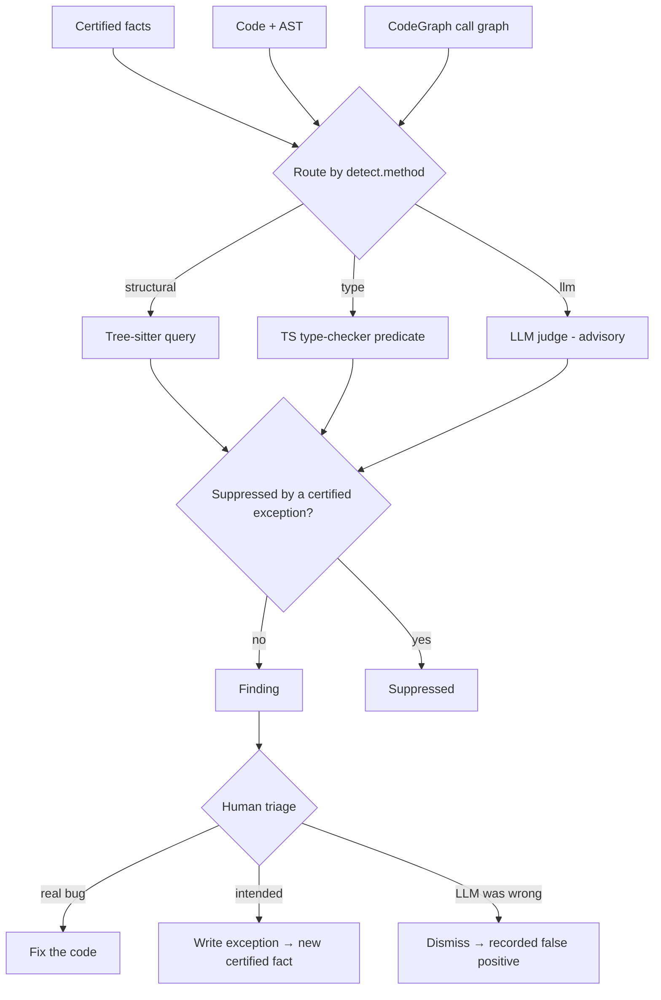

# Artha — contradiction detection (design spec)

> Companion to `Product.md`. Designs the v0.3 "loophole / bug-finder" view (Product.md §10.2) on paper before it's built — it carries the most technical risk and the most payoff.
> Stack assumption: JavaScript/TypeScript. Tiers that need type information are JS/TS-specific; the structural and LLM tiers port across languages.

---

## 1. What this is, and why only Artha can do it

A linter has rules but no product intent. A code-only graph (CodeGraph) has intent-free structure. Artha holds **certified intent** — invariants, flows, decisions — *and* a structural graph. The contradiction checker is the one feature that falls out of having both: it **diffs stated intent against reality.**

> Core operation: for each certified fact, ask "does the code (or another fact) still agree with this?" A disagreement is a contradiction — a probable bug, a loophole, or a layer that has drifted out of sync with itself.

This is categorically different from staleness (Product.md §8). Staleness asks "did the code under a pin *change*?" Contradiction asks "does the code *violate* what the fact asserts?" Code can change without violating, and violate without changing (e.g. a new caller breaks an invariant the pinned symbol still satisfies locally).

---

## 2. Scope — three contradiction classes

1. **Invariant violation** — code that breaks a rule a human certified ("money is integer minor units," but `refunds.ts` does `amount * 1.05`).
2. **Uncovered flow** — a certified flow declares a transition/branch with no implementation behind it (the spec says "on `shipped`, send notification"; no symbol does).
3. **Conflicting facts** — two certified facts that contradict each other, i.e. the semantic layer is internally inconsistent.

**Explicitly out of scope here** (handled elsewhere): staleness (the §8 watcher); dangling pins to symbols that no longer exist (caught at `artha build` as an integrity error, though the checker re-surfaces them as low-severity findings if they slip through). Style/lint concerns are *not* Artha's job — if a rule is enforceable by ESLint, it should live in ESLint, not as an Artha invariant.

---

## 3. Detection strategy — deterministic first, LLM last and advisory

The single design decision that makes or breaks trust: **detectors are layered, and the layers differ in whether they can be *wrong*.**

| Tier | Mechanism | Cost | Can it false-positive? | Reach |
|---|---|---|---|---|
| **1. Structural** | tree-sitter query over the AST | cheap | **No** — a match is an exact syntactic match | syntactic patterns only |
| **2. Type-aware** | TS compiler / `ts-morph` type predicate | medium | **No** — driven by the real type checker | type-level facts (JS/TS only) |
| **3. LLM-judged** | LLM evaluates the rule text against a code region | expensive | **Yes** | fuzzy/semantic rules nothing else can express |

The rule for each invariant: **use the cheapest tier that can express it.** Tiers 1–2 are *exact* — they don't guess, so they never hallucinate a violation (they may still flag an intended exception, which §6 handles). Tier 3 is the only source of false positives, so it is always **advisory**: it proposes a candidate a human must confirm, never an auto-flag, and it is gated behind a confidence threshold.

The payoff of layering, in precision/recall terms: deterministic tiers give **high precision, bounded recall** (trustworthy, zero-noise, but blind to fuzzy violations); the LLM tier **extends recall** at the cost of precision, fenced off as opt-in/advisory so it can't pollute the trusted signal. You get both without contaminating one with the other.



---

## 4. Detector 1 — invariant violations

This extends the `detect` block sketched in Product.md §6.2 into something executable. Each invariant declares a `detect` with a `method` and method-specific config; `scope` defaults to the invariant's own scope globs.

### 4.1 Structural method (preferred)

```yaml
# invariant.money_minor_units (detect block)
detect:
  method: structural
  query: |                     # tree-sitter query (illustrative; node names per tree-sitter-javascript)
    (binary_expression
      operator: ["*" "/"]
      right: (number) @amt
      (#match? @amt "\\."))    # operand is a non-integer literal
  severity: high
```

Deterministic. Every match in scope is a finding. It will miss type-laundered cases (a float hidden behind a variable) — that's the bounded-recall tradeoff, and the reason Tier 2 exists.

### 4.2 Type-aware method (when it needs types)

When the codebase has a branded type (`type Cents = number & { __brand: 'cents' }`) or the violation is type-level, a tree-sitter pattern can't see it. Use the TS type checker via `ts-morph`:

```yaml
detect:
  method: type
  ts_predicate: |              # pseudocode against the TS compiler API
    isArithmetic(node) &&
    operandHasBrandedType(node, "Cents") &&
    !isIntegerExpression(otherOperand(node))
  severity: high
```

Still deterministic (the type checker is ground truth), just heavier and JS/TS-bound.

### 4.3 LLM method (escalation, advisory only)

For invariants that resist structural expression — "money math must happen at the edge, not in domain services":

```yaml
detect:
  method: llm
  prompt_hint: >
    Flag code in scope where monetary amounts are computed as floating point,
    or where money arithmetic happens outside the Money helper.
  confidence_min: 0.8          # below → drop; at/above → propose to a human
  advisory: true               # invariant: llm method is ALWAYS advisory
```

The LLM receives the invariant text + the candidate region + minimal surrounding context, and returns `{ violates: bool, confidence: float, why: string }`. Never auto-confirmed.

### 4.4 Worked example (the `refunds.ts` flag from the mockup)

1. `invariant.money_minor_units` is certified, structural method, scope `src/billing/**`.
2. `artha check` runs the tree-sitter query against billing files.
3. Match in `src/billing/refunds.ts#applyFee`: `amount * 1.05`.
4. No certified exception covers this site (§6) → a finding is emitted:

```yaml
id: finding.7c3
class: invariant_violation
fact: invariant.money_minor_units
locations:
  - symbol: src/billing/refunds.ts#applyFee
    span: { line: 42, col: 12 }
    evidence: "amount * 1.05"
method: structural
confidence: 1.0
severity: high
status: open
```

5. The dashboard shows the red "violates invariant" flag on `refunds.ts` (Product.md §10.2). The human either fixes the code, or — if the next line already rounds with a banker's-rounding helper and it's intentional — marks a sanctioned exception (§6), which suppresses it going forward.

---

## 5. Detector 2 — uncovered flow

This is where Artha leans hardest on CodeGraph's call graph, and it's uniquely enabled by holding the declared flow *and* the structure.

A `flow` (Product.md §6.5) declares ordered steps/transitions, each ideally pinned to an entry symbol. A transition is **covered** when:
- (a) a `pin` exists for it, and
- (b) the pinned symbol exists in CodeGraph, and
- (c) optionally, a call path connects the flow's entry symbol to the transition's handler in the call graph.

**Uncovered** = a declared transition failing (a), (b), or (c). Concretely:

```yaml
# flow.checkout declares:
transitions:
  - { on: "payment_succeeded", do: "reserve_inventory", pin: "src/checkout/onPaid.ts#reserve" }
  - { on: "order_shipped",     do: "send_notification", pin: null }   # ← no implementation
```

The second transition has `pin: null` → finding `class: uncovered_flow`, severity medium: *"the flow asserts a notification on ship; nothing implements it."* The (c) check goes further — if `onPaid.ts#reserve` exists but the call graph shows no path from the checkout entry point reaching it, the transition is declared-but-unreachable, also uncovered.

This catches a class of bug invisible to both linters (no notion of the flow) and auto-wikis (they'd document the code that *is* there, not notice the absence of code that *should* be).

---

## 6. Detector 3 — conflicting facts

Two certified facts that contradict. Split by what's deterministically checkable from metadata vs. what needs judgment.

### 6.1 Deterministic consistency checks (cheap, exact)

Pure graph/reference checks over the compiled `.artha/` index:

- **Dangling supersession** — decision A has `supersedes: B`, but `B.status == certified`. The superseded fact should be archived; two "live" contradictory decisions is a finding (high severity — the layer asserts both).
- **Flow ↔ concept transition mismatch** — a flow references a transition `(from X → Y)` that isn't in the concept's declared `transitions`. One of them is wrong.
- **Pin integrity** — a pin resolves to no symbol (build should have caught it; re-surfaced low-severity).
- **Scope overlap with opposing detect** — two invariants whose `scope` globs intersect and whose structural `detect` queries are provably mutually exclusive (e.g. one mandates a pattern, the other forbids it in the same files).

These are deterministic and exact; they form the backbone of this detector.

### 6.2 Semantic contradictions (LLM, advisory, scope-bounded)

Two free-text rules that *mean* opposite things can only be judged by an LLM. The danger is the n² pairwise blowup, so it is **bounded by scope overlap**: only facts whose `scope`/pinned symbols intersect are compared. Within each overlapping cluster, the LLM judges pairs and proposes candidates a human confirms. Judgments are cached (§8) keyed on the two facts' content hashes, so a pair is judged once and only re-judged when one fact's text changes.

---

## 7. The finding object & lifecycle

A **finding is transient** — recomputed from facts + code on every run, like a compiler diagnostic. Findings are *not* committed (they'd go stale instantly). What *is* committed: durable human decisions — sanctioned exceptions and dismissals (§8).

```
status: open → { sanctioned | resolved | false_positive }
```

- `open` — emitted, not yet triaged.
- `sanctioned` — human confirmed it's intended → an `exception` fact is written (§8); suppressed thereafter.
- `resolved` — the code/fact was fixed; the finding simply stops appearing on the next run.
- `false_positive` — only reachable from the LLM tier; the human says the judge was wrong → recorded so it isn't re-proposed and so LLM-tier precision can be measured.

Severity defaults: invariant violations inherit the invariant's declared `severity` (default medium); uncovered flow = medium; conflicting certified facts = high (self-inconsistency is worse than a single code violation).

---

## 8. Sanctioned exceptions — the learning loop

This is the mechanism that makes the false-positive rate *fall* with use (Product.md §14, risk 5). When a human marks a violation intended, it becomes a first-class certified fact:

```yaml
# .artha/exceptions/refunds-fee-rounding.yaml
id: exception.refunds_fee_rounding
kind: exception
status: certified
suppresses: invariant.money_minor_units
at:
  symbol: src/billing/refunds.ts#applyFee
  evidence_hash: 5a1b          # ties to THIS site's code; lapses if it changes materially
reason: >
  Fee rate is applied then rounded with bankersRound() on the next line. Reviewed, intentional.
certified_by: brijesh
date: 2026-06-20
```

Before emitting any finding, every detector checks for a matching certified exception (by `suppresses` + `symbol` + `evidence_hash`) and suppresses it. If the code at that site changes (the `evidence_hash` no longer matches), the exception **lapses** and the finding reappears for re-review — the same staleness philosophy as §8, applied to exceptions. So exceptions are precise (per-site, not blanket) and self-expiring, never a silent permanent mute.

LLM-tier false positives are handled separately: a `false_positive` dismissal is recorded but does *not* become a certified fact (nothing was true to certify) — it just suppresses re-proposal and feeds the precision metric.

---

## 9. Where & when it runs — the cost model

The governing principle: **deterministic tiers run always (they're cheap); the LLM tier is gated, batched, and cached.**

- **On-demand (v0.3):** `artha check [--scope <area>]` from the CLI, and the dashboard's contradiction view. Default to **incremental** — re-check only facts whose scope intersects symbols changed since the last run (using CodeGraph structure + content hashes). Full scans are rare and explicit (`--all`).
- **PR integration:** run scoped to the diff in CI; post findings as review comments. Deterministic tiers run on every PR; the LLM tier runs only on PRs touching scopes with `method: llm` facts, batched into one call set.
- **Watcher (v0.4):** deterministic tiers fire on every change (negligible cost); the LLM tier is deferred to PR-time or a nightly batch — never on the hot path of a keystroke.
- **Caching:** LLM judgments are cached keyed on `(fact_content_hash, code_region_hash)` (and `(factA_hash, factB_hash)` for conflicts). Same inputs → cached verdict, so results are **stable** run-to-run and cost is paid once per unique pair.

This keeps the common developer loop free (deterministic-only, sub-second incremental) while still offering LLM reach where a team opts into it.

---

## 10. Build order (de-risking the build itself)

Implement cheapest-and-most-trustworthy first; each step is independently useful and validates the next:

1. **Deterministic conflicting-facts checks (§6.1)** — pure metadata over the index. Zero new dependencies, zero false positives, immediate value (catches layer inconsistencies). Lowest risk, highest certainty.
2. **Structural invariant detector (§4.1)** — tree-sitter (already a CodeGraph dependency) + the `detect.query` schema. The headline feature; deterministic.
3. **Sanctioned-exception loop (§8)** — needed before anyone trusts #2 in anger, or noise will sink it.
4. **Flow-coverage detector (§5)** — needs the CodeGraph call graph; depends on the `flow` kind shipping (v0.2).
5. **Type-aware detector (§4.2)** — `ts-morph` integration; higher cost, JS/TS-bound.
6. **LLM tiers (§4.3, §6.2)** — last, behind a flag, advisory, with caching from day one.

Steps 1–3 alone deliver a deterministic, zero-hallucination bug-finder. Everything after extends reach.

---

## 11. Open questions / risks specific to this feature

1. **`detect` DSL expressiveness vs. simplicity.** How rich should the structural query layer be before falling back to LLM? Raw tree-sitter queries are powerful but hostile to non-coder contributors. A thin declarative wrapper is friendlier but is itself a mini-language to maintain. Lean minimal; let LLM-tier absorb the long tail.
2. **Defining "scope overlap" precisely** for glob intersection — needed to bound both the conflicting-facts n² and incremental re-check sets. Probably: compile globs to file sets at build time and intersect.
3. **Type-tier portability.** Tier 2 needs per-language type tooling (TS compiler for JS/TS, something else for Python). Tiers 1 and 3 port; Tier 2 doesn't. Accept that type-aware detection is a per-language investment.
4. **LLM determinism and drift.** Caching gives stability, but a model upgrade silently invalidates cached verdicts. Version the cache key with the model id so upgrades re-judge transparently rather than mixing verdicts.
5. **Exception granularity.** Per-site `evidence_hash` exceptions are precise but can proliferate on churny files (every refactor lapses them). Watch the exception-churn rate; consider symbol-level (not span-level) exceptions for stable APIs.
6. **Severity inflation.** If everything is "high," nothing is. Keep severities honest and let teams tune per-invariant.

---

*The thesis of this design, in one line: deterministic detectors are exact and trusted, the LLM detector is advisory and bounded, and every human decision becomes a durable fact — so over time the signal sharpens and the noise falls, which is the only way a bug-finder like this stays trusted instead of muted.*
